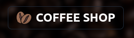

<div id="top"></div>
<!--
*** Thanks for checking out the Best-README-Template. If you have a suggestion
*** that would make this better, please fork the repo and create a pull request
*** or simply open an issue with the tag "enhancement".
*** Don't forget to give the project a star!
*** Thanks again! Now go create something AMAZING! :D
-->


<!-- PROJECT SHIELDS -->
<!--
*** I'm using markdown "reference style" links for readability.
*** Reference links are enclosed in brackets [ ] instead of parentheses ( ).
*** See the bottom of this document for the declaration of the reference variables
*** for contributors-url, forks-url, etc. This is an optional, concise syntax you may use.
*** https://www.markdownguide.org/basic-syntax/#reference-style-links
-->
[![Contributors][contributors-shield]][contributors-url]
[![Forks][forks-shield]][forks-url]
[![Stargazers][stars-shield]][stars-url]
[![Issues][issues-shield]][issues-url]
[![MIT License][license-shield]][license-url]
[![LinkedIn][linkedin-shield]][linkedin-url]


<!-- PROJECT LOGO -->
<br />
<div align="center">
  <a href="https://coffeshop-martinez.vercel.app/">
    
  </a>

<h3 align="center">Coffe Shop - Ecommerce</h3>

  <p align="center">
    Proyecto Final para el curso de React JS.
    <br />
    <a href="https://github.com/julianmartinez-dev/coffeshop-martinez"><strong>Explore the docs »</strong></a>
    <br />
    <br />
    <a href="https://github.com/julianmartinez-dev/coffeshop-martinez">View Demo</a>
    ·
    <a href="https://github.com/julianmartinez-dev/coffeshop-martinez/issues">Report Bug</a>
    ·
    <a href="https://github.com/julianmartinez-dev/coffeshop-martinez/issues">Request Feature</a>
  </p>
</div>

<br>
<br>


## Table of contents
 <details>
  <summary>Table of Contents</summary>
  <ol>
    <li>
      <a href="#about-the-project">About The Project</a>
      <ul>
        <li><a href="#description">Description</a></li>
        <li><a href="#user-stories">User Stories</a></li>
        <li><a href="#base-requirements">Base Requirements</a></li>
        <li><a href="#built-with">Built With</a></li>
      </ul>
    </li>
    <li>
      <a href="#for-developers">For developers</a>
      <ul>
        <li><a href="#prerequisites">Prerequisites</a></li>
        <li><a href="#installation">Installation</a></li>
      </ul>
    </li>
    <li><a href="#usage">Videos Demo</a></li>
    <li><a href="#roadmap">Roadmap</a></li>
    <li><a href="#contributing">Contributing</a></li>
    <li><a href="#license">License</a></li>
    <li><a href="#contact">Contact</a></li>
    <li><a href="#acknowledgments">Acknowledgments</a></li>
  </ol>
</details>

<br>
<br>


<!-- ABOUT THE PROJECT -->
## About The Project

![Product Name Screen Shot][product-screenshot]

## Description

Para el curso de ReactJs de Coderhouse he desarrollado una plataforma ecommerce para la venta de café y articulos relacionados. La plataforma esta desarrollada en ReactJS y esta disponible en el repositorio de GitHub, desplegada en Vercel, los datos son almacenados en Firebase. Para el desarrollo de la plataforma he utilizado librerias tales como: Tailwindcss para el desarrollo de la apariencia junto con DaisyUI que es una libreria de componentes basados en tailwindcss, React-Router para la navegacion.
 Tambien utilicé una libreria de llamada React-Toastify para darle un feedback al usuario al realizar una accion o recibir alguna respuesta del servidor.
 Como un extra agregué la capacidad de poder descargar una PWA para la plataforma mediante el navegador de Google Chrome, usando Vite-Plugin-PWA.


## User stories

-  Un usuario debe poder ingresar, navegar por los productos e ir a sus detalles.
-  Desde el detalle se debe poder ver la descripción, foto y precio e ingresarlo al carrito. 
-  Una vez que el carrito tenga al menos un producto, se deberá visualizar un listado compacto de la orden con el precio total. 
-  Al ingresar su nombre, apellido, teléfono e e-mail (ingresándolo dos veces para corroborar que sea correcto), debe activarse el botón de ‘realizar compra’.
-  Al clickear ‘realizar compra’ debe guardarse en la base de datos una orden que tenga todos los productos, la fecha y dar feedback del número de orden.

### Base Requirements
- Inicio: Al momento de ingresar a la app en la ruta base ‘/’
Visualizar -como mínimo- un set de productos disponibles para la compra.
Contar con algún acceso visible a la vista de carrito que debe alojarse en el route <b>/cart.</b>
Acceder a un menú desplegable que contendrá las categorías. Al clickear en una, debe navegar a la lista de productos de la misma mediante un route /categories/:categoryId. Éste invocará la misma vista que el home, pero visualizando sólamente productos de esa categoría.

- Flow: Al clickear un ítem del listado debe navegar a la ruta /item/:id, donde id es el id del item (generado por firebase), y ver la descripción del producto ( foto, precio, selector de cantidad). Si se ingresa a /item/:id y el producto no existe en firebase, debemos responder un mensaje adecuado que indique algo relacionado a que el producto no existe.
- Firebase:
<u><b>Implementar al menos dos colecciones:</b></u><br>
- <u><b>items: catálogo completo</b></u>
Link para foto (puede almacenarse de modo estático en la página en una subruta /images/:itemid )
Precio unitario
Descripción (sólo se ve en detalle)
Categoria (id a mano para versión estática, o id de firebase para versión dinámica -opcional-)
- <u><b>orders:</b></u> las órdenes generadas, que deben incluir los productos, descripciones y los precios al momento de la compra. 
- Las órdenes deben poder tener items surtidos, cada uno con su cantidad. Por ejemplo: remeras x 2 y gorra x 1
id, items, fecha, estado ( por defecto en ‘generada’)
- El cart debe ser accesible durante toda la experiencia y tener una indicación de la cantidad de items incluidos agregados (ej. si hay un ítem con dos unidades y un ítem con una unidad, debe decir ‘tres’).
- Checkout mínimo:
Items con sus cantidades
Total de la orden
Input para nombre, apellido y teléfono
Input para email y lógica de repetir el email 2 veces (a excepción de que realicen el desafío extra de auth, en ese caso no sería necesario)
- Finalizada la orden, debo recibir mi order id con el id del objeto de firebase.
- La navegabilidad debe ocurrir utilizando el router, y no href’s o location.
- Por cada librería pública extra que utilices, deberás incluir en algún archivo el link al proyecto, y una justificación de por qué agrega valor.


<p align="right">(<a href="#top">back to top</a>)</p>


# Built With

* [React.js](https://reactjs.org/)
* [Vite](https://vitejs.dev/)
* [Tailwind](https://tailwindcss.com/)
* [DaisyUI](https://daisyui.com/)
* [Firebase](https://firebase.google.com/)
* [React-Toastify](https://www.npmjs.com/package/react-toastify)
* [Vite-Plugin-PWA](https://vite-plugin-pwa.netlify.app/)

<p align="right">(<a href="#top">back to top</a>)</p>

<!-- USAGE EXAMPLES -->

## Video Demo
 

https://user-images.githubusercontent.com/93665971/172989458-d2baea59-c427-4b3b-8ced-54c07846369d.mp4

https://user-images.githubusercontent.com/93665971/172989446-a93e685d-9112-4a46-89f8-abebf55e1a50.mp4

https://user-images.githubusercontent.com/93665971/172989441-6d050229-2f6c-41d6-ba85-27c1ea522b94.mp4


 

<p align="right">(<a href="#top">back to top</a>)</p>

<!-- For developers -->
## For Developers

To get a local copy up and running follow these simple example steps.

### Prerequisites

This is an example of how to list things you need to use the software and how to install them.
* npm >= 12.2.0
  ```sh
  npm install npm@latest -g
  ```


### Installation

2. Clone the repo
   ```sh
   git clone https://github.com/julianmartinez-dev/coffeshop-martinez.git
   ```
3. Install NPM packages
   ```sh
   npm install
   ```
4. To run the app
   ```sh
   npm run dev
   ```
5. To preview the build
   ```sh
   npm run preview
   ```
6. To create a new build
   ```sh
   npm run build
   ```

<p align="right">(<a href="#top">back to top</a>)</p>

## Environment Variables

To run this project, you will need to add the following environment variables to your .env file

```
VITE_FIREBASE_AUTHDOMAIN
VITE_FIREBASE_PROJECTID
VITE_FIREBASE_STORAGEBUCKET
VITE_FIREBASE_MESSAGINGSENDERID
VITE_FIREBASE_APPID
```

<p align="right">(<a href="#top">back to top</a>)</p>


<!-- ROADMAP -->
## Roadmap

-  Se inicia el proyecto y se agrega stock de productos localmente
-  Se agrega react-router-dom para la navegación.
-  Se cambia la UI.
-  Se agrega carrito de compras.
-  Se integra con backend en Firebase.
-  Se agrega checkout.
-  Se agrega pwa.

See the [open issues](https://github.com/julianmartinez-dev/coffeshop-martinez/issues) for a full list of proposed features (and known issues).

<p align="right">(<a href="#top">back to top</a>)</p>


<!-- CONTRIBUTING -->
## Contributing

Contributions are what make the open source community such an amazing place to learn, inspire, and create. Any contributions you make are **greatly appreciated**.

If you have a suggestion that would make this better, please fork the repo and create a pull request. You can also simply open an issue with the tag "enhancement".
Don't forget to give the project a star! Thanks again!

1. Fork the Project
2. Create your Feature Branch (`git checkout -b feature/AmazingFeature`)
3. Commit your Changes (`git commit -m 'Add some AmazingFeature'`)
4. Push to the Branch (`git push origin feature/AmazingFeature`)
5. Open a Pull Request

<p align="right">(<a href="#top">back to top</a>)</p>


<!-- LICENSE -->
## License

Distributed under the MIT License. See `LICENSE.txt` for more information.

<p align="right">(<a href="#top">back to top</a>)</p>


<!-- CONTACT -->
## Contact

Julian Martinez - [@twitter_handle](https://twitter.com/julmartinezdev) - julian.fmartinez@gmail.com

Project Link: [https://github.com/julianmartinez-dev/coffeshop-martinez](https://github.com/julianmartinez-dev/coffeshop-martinez)

<p align="right">(<a href="#top">back to top</a>)</p>


<!-- MARKDOWN LINKS & IMAGES -->
<!-- https://www.markdownguide.org/basic-syntax/#reference-style-links -->
[contributors-shield]: https://img.shields.io/github/contributors/julianmartinez-dev/coffeshop-martinez.svg?style=for-the-badge
[contributors-url]: https://github.com/julianmartinez-dev/coffeshop-martinez/graphs/contributors
[forks-shield]: https://img.shields.io/github/forks/julianmartinez-dev/coffeshop-martinez.svg?style=for-the-badge
[forks-url]: https://github.com/julianmartinez-dev/coffeshop-martinez/network/members
[stars-shield]: https://img.shields.io/github/stars/julianmartinez-dev/coffeshop-martinez.svg?style=for-the-badge
[stars-url]: https://github.com/julianmartinez-dev/coffeshop-martinez/stargazers
[issues-shield]: https://img.shields.io/github/issues/julianmartinez-dev/coffeshop-martinez.svg?style=for-the-badge
[issues-url]: https://github.com/julianmartinez-dev/coffeshop-martinez/issues
[license-shield]: https://img.shields.io/github/license/julianmartinez-dev/coffeshop-martinez.svg?style=for-the-badge
[license-url]: https://github.com/julianmartinez-dev/coffeshop-martinez/blob/master/LICENSE.txt
[linkedin-shield]: https://img.shields.io/badge/-LinkedIn-black.svg?style=for-the-badge&logo=linkedin&colorB=555
[linkedin-url]: https://www.linkedin.com/in/julian-martinez-dev/
[product-screenshot]: /public/img/screenshots/home.png
[Watch the video]: https://streamable.com/2766mi
[@twitter_handle]: https://twitter.com/julmartinezdev
